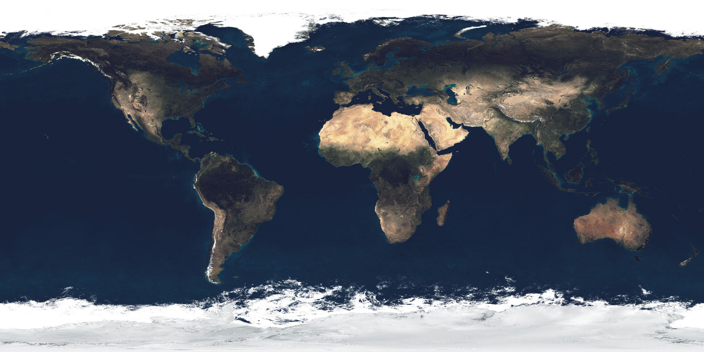

# AGENTS.md — 地球昼夜交替 3D 演示

## 项目本质
单文件 HTML 3D 教学演示（`index.html`），无构建工具、无服务器依赖、零 npm 依赖。双击即可在浏览器运行。所有代码和纹理在同一个仓库中。

## 关键约束（必读）
- **`file://` 协议兼容**：必须能用浏览器直接双击 `index.html` 打开。纹理**优先从 `textures.embed.js`（base64 data URI）加载**——Chrome 会拦截 file:// 页面把 `` 上传为 WebGL 纹理（SecurityError/DOMException），data URI 不受限制。`` 方式保留为回退（http/本地服务器场景）。禁用 Three.js 的 `TextureLoader`。
- **纹理再生成**：更换 `textures/` 下的图后，需重新生成 `textures.embed.js`（读图 → base64 → `window.TEX_EMBED = { earthDay, earthSpec, sun }`）。
- **Three.js 版本**：r160，通过 CDN 的 importmap 加载（`cdn.jsdelivr.net/npm/three@0.160.0`）。改版本须同步改 CDN 链接。

## 启动方式
```
# 无需任何命令，直接双击 index.html 即可
# 如需查看 console，用浏览器打开后按 F12
```

## 场景层级架构（不应搞错）
```
scene
  └─ axisGroup (rotation.x = TILT=23.44°)  ← 地轴固定指向星空
       ├─ spinGroup (rotation.y = 每天自转)  ← 所有地球上的物体挂这里
       │    ├─ 地球网格 (ShaderMaterial)
       │    ├─ 赤道圈、极圈、经度刻度圈
       │    ├─ 城市标记 (dot + label sprite)
       │    └─ ...
       ├─ 地轴线 (Line, 从 axisGroup 原点出发)
       └─ ...
  └─ 太阳 (Mesh + Sprite glow, 在 scene 层级，不在 spinGroup 内)
```
重要：**太阳不随地球旋转**。城市光照判定基于世界坐标点积（`dot.getWorldPosition().normalize() · sunDir`），不使用局部坐标。

## 季节/太阳位置系统（2026-09 重构）
- **原硬编码 `SUN_POS=(7.34,2.93,-1.27)` 实际赤纬仅 ≈15.8°**，不满足"晨昏线切北极圈"，已废弃。
- 现由 `sunPosFor(declDeg)` 精确计算：地轴世界系固定为 `(0, cosT, sinT)`，解 `sunDir·axis = sin(δ)` 反求仰角；方位角 `SUN_AZ` 沿用原夏至值（保证镜头构图不变），`SUN_R=8`。
- `SEASONS`：春分/秋分 δ=0，夏至 δ=+23.44°，冬至 δ=−23.44°。切换时太阳位置在 animate 中指数平滑过渡（`sunPosTarget`），暂停时也可切换。
- `uniforms.sunDir` 与云层 shader 共享同一 uniform 对象。

## 新增功能
- **云层已移除**（2026-09-28）：曾短暂加入后应需求撤下，`textures/earth_clouds_1024.png` 已转为 L 灰度模式但未被引用。若将来恢复云层，注意老版 three.js 云贴图多为 P 模式（RGB 恒白、形状在 alpha 通道），自定义 shader 不能直接取 `.r` 当密度。
- **大气辉光壳已移除**（2026-09-28）：Fresnel BackSide 外壳曾加入后应需求撤下；地表 shader 内部残留的轻微 rim（`* 0.04`）保留，不影响轮廓。
- **视角锁定**（2026-09-30）：`viewLocked=true` 默认锁死相机（`controls.enabled=false`），禁用手动转动/缩放，城市/极点聚焦也被忽略；右下按钮是切换开关——"🔓 解除锁定"→解锁并可手动操作，"⟲ 重置视角"→相机与地球朝向复位到初始状态并重新锁定。
- **星空**：1600 点 `THREE.Points`，半径 40–75 随机球壳。
- **直射点面板**：`#sunInfo` 每 200ms 由实际 `sunDir·axisW` 反算直射纬度并匹配最近季节标签。
- **城市记忆**：`localStorage['earthDemoCities']` 存 `{name,lat,lng,country,visible}`；加载时存档优先于 `INITIAL_CITIES`；增删/显隐/总开关均触发 `saveCities()`。file:// 下 localStorage 不可用时静默降级。

## 夏至配置（不可随意改动）
- `TILT = 23.44°`（地轴倾角）
- `SUN_POS = (7.34, 2.93, -1.27)` — 夏至太阳方向，晨昏线与北极圈 (66.5°N) 相切
- 初始 `spinGroup.rotation.y = 2.618`（150°），使中国（~120°E）面向摄像机

## 纹理加载模式
```html
<!-- HTML 中隐藏的 img 标签 -->

```
```js
// JS 中加载方式：
loadImgEl('texEarthDay').then(img => {
  const t = new THREE.Texture(img);
  t.colorSpace = THREE.SRGBColorSpace;
  t.needsUpdate = true;
  uniforms.dayTex.value = t;
});
```
`loadImgEl` 用 `img.decode()` 确保图像解码完成。所有纹理加载在异步 IIFE 中，失败时有 fallback canvas 纹理。

## 城市管理系统
- **CITY_DB**：内置城市数据库（2026-09-28 扩充至 **512 城**）：
  - 中国 349 城：4 直辖市 + 全部地级行政区（地级市/自治州/盟用首府名，如延吉、西昌、大理、香格里拉、喀什）+ 港澳台主要城市
  - 世界 163 城：约 110 国首都（注意：缅甸=内比都、坦桑尼亚=多多马、哈萨克斯坦=阿斯塔纳、南非行政首都=比勒陀利亚、瑞士=伯尔尼、土耳其=安卡拉、巴西=巴西利亚、加拿大=渥太华、澳大利亚=堪培拉）+ 34 个主要非首都大城市（纽约、迪拜、伊斯坦布尔等）
  - 港澳台 country 字段用 '中国香港'/'中国澳门'/'中国台湾'
- **INITIAL_CITIES**：9 个初始城市（北京、上海、乌鲁木齐、东京、悉尼、伦敦、纽约、深圳、莫斯科），**初始全部隐藏**——面板默认折叠，初始统一强制 `visible=false`（同时覆盖旧 localStorage 存档的 visible 残留）；点击展开面板后由总开关统一显示。新默认城市会自动合并进旧存档（按 名称+国家 判重）
- **动态增删**：`addCityToScene(data)` / `removeCityById(id)` / `toggleCityVisibility(id)`
- **搜索**：基于 CITY_DB 的本地字符串匹配（`name.includes(q)` 或 `country.includes(q)`），不使用外部 API；"已添加"判断用 `城市名|国家` 联合 key（防同名城市误判，如智利/古巴的圣地亚哥）
- **ID 系统**：每个城市有唯一自增 `id`，非数组索引查找。面板元素 id 格式 `ci-${id}`、`cd-${id}`、`ct-${id}`
- **城市面板默认折叠**：点击标题展开/收起，展开时城市标记出现在地图上，收起时全部隐藏
- **防重复**：`addCityToScene` 检查 `city.name + city.country` 组合

## 命令速查
无构建/测试命令。修改后直接刷新浏览器验证。

## 开发注意事项
1. **不改纹理加载方式** — 不要试图换成 TextureLoader，会破坏 file:// 兼容
2. **不改层级结构** — axisGroup→spinGroup 的父子关系支撑了地轴固定逻辑和极昼模拟
3. **不改夏至常数** — TILT 和 SUN_POS 是教学正确性的基础
4. **城市操作后必须同步 Three.js 对象和 DOM** — 移除城市时要 dispose geometry/material 并从 spinGroup 移除
5. **城市标记放在 spinGroup 下** — 随地球自转，但点击聚焦时用 `getWorldPosition` 获取世界坐标
6. **动画循环每帧更新** — `updateCities()` 每 200ms 计算一次日照状态，cityData.forEach 处理可见性呼吸动画
7. **Shader 使用 `texture` 而非 `texture2D`** — WebGL2 兼容
